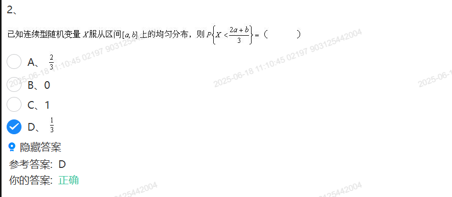
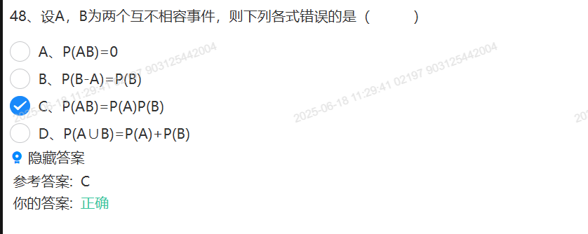
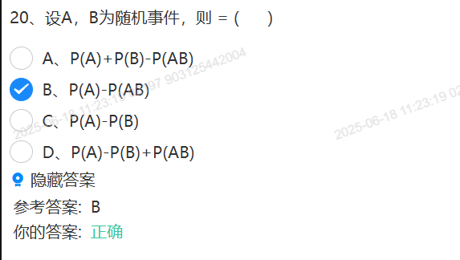
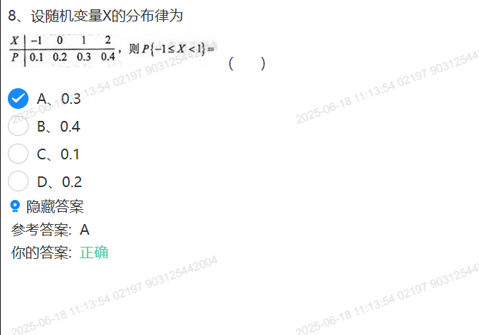
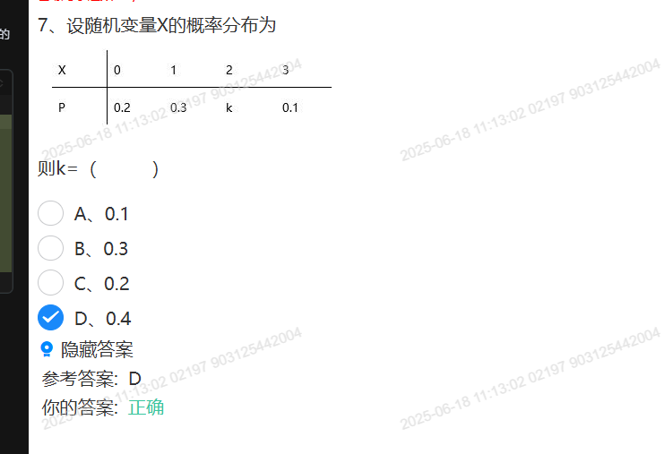
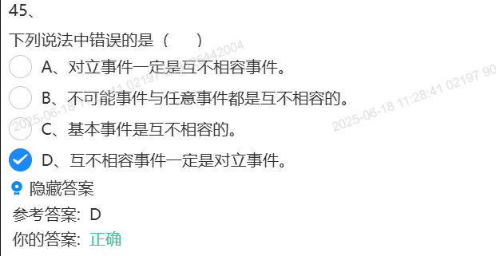
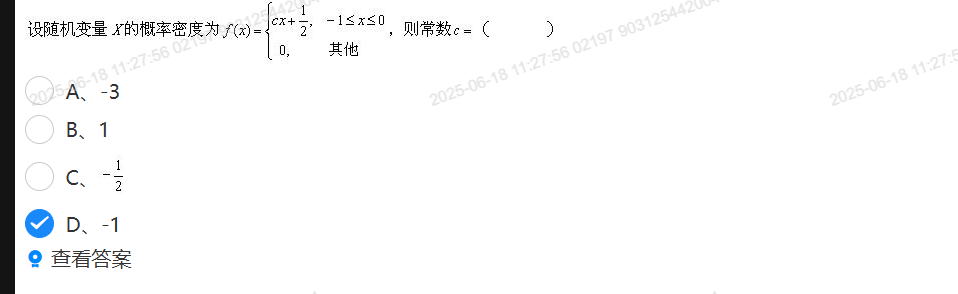
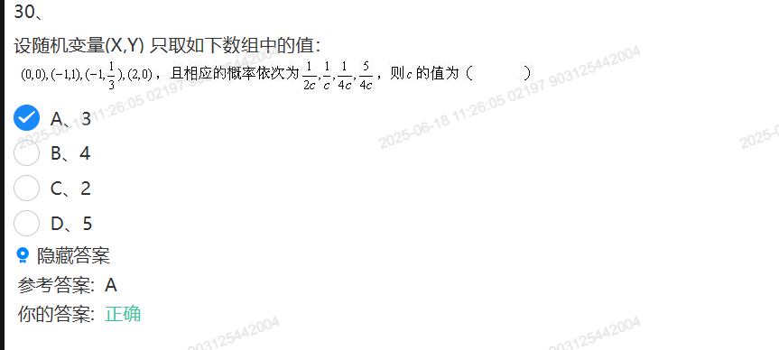
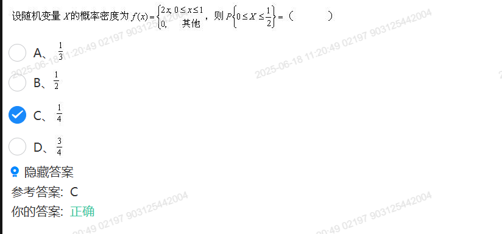
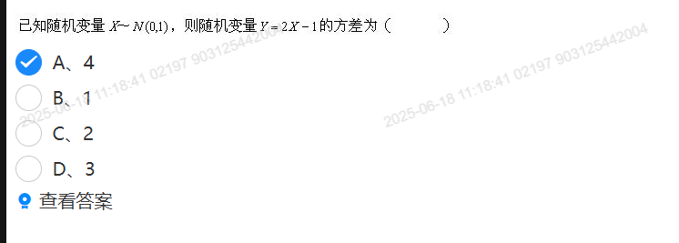

## 选择题

### 1：连续随机变量x服从

### 48： 设A,B为两个互不相容事件，则下列各式错误

### 20：设A,B为随机事件，则

### 8：随机变量X的分布规律

### 7：随机变量X的概率分布

### 45：下列说法错误

### 10：已知P(A)=0.3
=0.3.png)

### 9：则常数c=

### 30：则c的值为

### 12：则E(X)=
=.png)

### 21：则E(x+y)=
=.png)

### 23： f(x,y)%20则k=.
%20则k=.png)

### 24: X的概率密度为

### 25: Y=2x-1的方差为

### 26：
随机变量X服从二项式分布B(n,p),则有D(x)/E(x)=

答案：1-p

### 27：
设（x1,x2,x3）是来自正态总体N(u,U2)的样本。则u的无偏估计是

答案：(x1+x2+x3)/3

### 28
袋子中有红球5个，白球3个，2个黑球，现从中任取3个球，器恰为一红一白一黑的概率为

答案：1/4

### 29
设E(x)=E(y)=2,cov(x,y)=-1/6,则E(xy)为

答案：23/6

### 30
设随机变量x服从二项式分布B(n,p),已知E(x) =2.4,D(x)=1.44;则n,p 分别为？

答案:n = 6, p = 0.4。

### 31
一盒零件5个正品，两个次品，不放回任取3个，其中至少2个正品概率为

答案：6/7