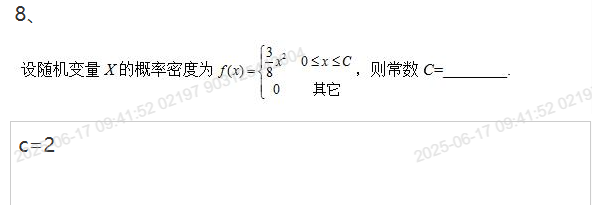

##填空题

## 1.一口袋中有5个黄球及3个绿球，从中任取两个，颜色相同的概率为______．

13/28

## 2.掷一枚均匀的骰子，

1/3

## 3 设二维变量（X,Y）服从区域D

## 4 设二维变量（X,Y）的联合概率分布

## 5.某地一年内发生旱灾的概率为1/3，则在今后连续四年内至少有一年发生旱灾的概率为__________．

65/81

## 6.有5条线段，其长度分别为1，3，5，7，9，从这5条线段中任取3条，所取的3条线段能拼成三角形的概率为________。

0.3

## 7 设随机变量X服从正态分不N(2,9)

## 8 则常数C=

## 9 P(A) = 

## 10 P(B|A) = 

## 11.设随机变量X的分布函数为F（x），已知F（2）＝0.6，F（－3）＝0.1，则P{－3<X≤2}＝_________,

0.5

## 12.袋中有50个乒乓球，其中20个黄球，30个白球，甲、乙两人依次各取一球，取后不放回，甲先取，则乙取得黄球的概率为_______。

2/5

